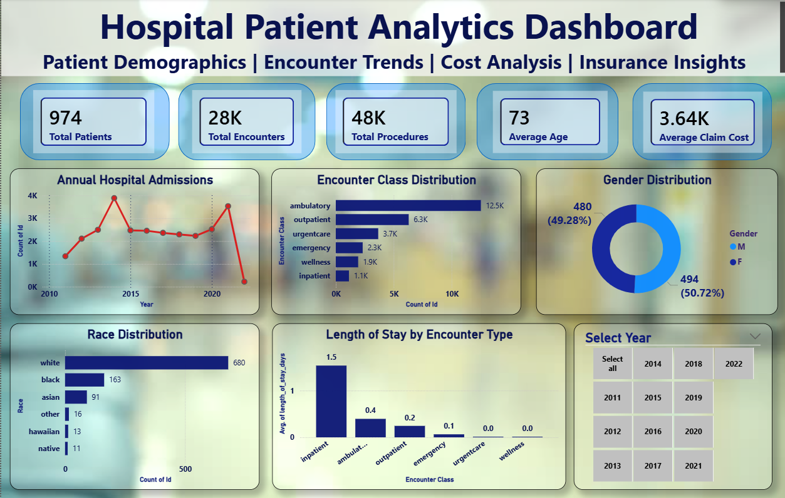
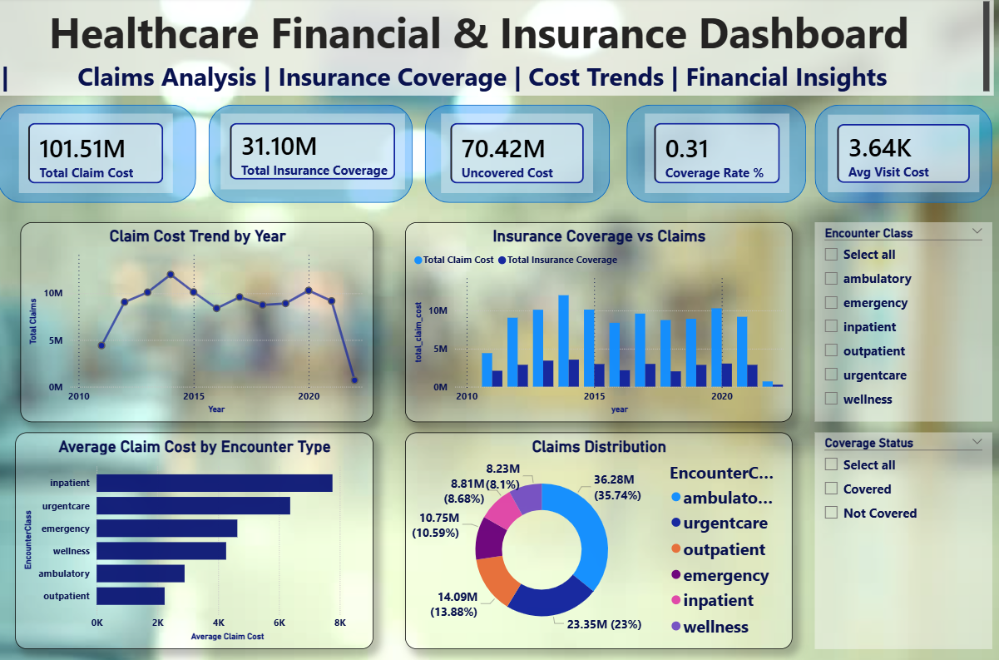

# 🏥 Hospital Patient Analytics Dashboard



## 📌 Project Overview

Healthcare organizations generate vast amounts of patient, operational, and financial data every day. This project focuses on transforming raw healthcare records into meaningful business insights through data cleaning, exploratory data analysis, SQL analytics, and interactive Power BI dashboards.

The project was built using **Python, MySQL, and Power BI** to analyze hospital operations, patient demographics, healthcare costs, insurance coverage, and financial performance.

This solution demonstrates a complete end-to-end Data Analytics workflow from raw data processing to business intelligence reporting.

---

## 🎯 Business Objectives

- Analyze patient demographics and healthcare utilization patterns.
- Track hospital admissions and encounter trends over time.
- Evaluate healthcare costs and insurance coverage.
- Identify high-cost encounter categories.
- Build interactive dashboards for operational and financial decision-making.

---

## 🛠️ Tech Stack

### Data Processing & Analysis
- Python
- Pandas
- NumPy

### Database
- MySQL

### Data Visualization
- Power BI

### Version Control
- Git & GitHub

---

## 📂 Project Structure

```text
Hospital-Patient-Analytics-Dashboard
│
├── Hospital_Analysis.ipynb
├── hospital.pbix
├── EDA.mwb
├── Hospital.png
├── Healthcare.png
├── README.md
└── LICENSE
```

---

## 🧹 Data Cleaning & Preparation

The data preparation process included:

- Missing value analysis
- Duplicate record validation
- Data type conversion
- Date format standardization
- Feature engineering
- Column name standardization
- Data quality assessment

### Features Created

- Admission Year
- Length of Stay (LOS)
- Financial Metrics
- Insurance Coverage Metrics

---

## 📊 Exploratory Data Analysis

### Patient Analysis
- Age Distribution
- Gender Distribution
- Race Distribution
- Demographic Insights

### Hospital Operations Analysis
- Admission Trends
- Encounter Type Analysis
- Procedure Analysis
- Length of Stay Analysis

### Financial Analysis
- Claim Cost Analysis
- Insurance Coverage Analysis
- Cost Distribution Analysis
- Coverage Rate Analysis

---

# 📈 Dashboard 1: Hospital Patient Analytics Dashboard


### Key Performance Indicators (KPIs)

- Total Patients
- Total Encounters
- Total Procedures
- Average Age
- Average Claim Cost

### Dashboard Insights

- Analyzed 974 patients across multiple healthcare encounters.
- Processed over 27,000 patient encounters.
- Evaluated more than 47,000 medical procedures.
- Identified admission trends across multiple years.
- Analyzed encounter class distribution.
- Explored patient demographics including age, gender, and race.

---

# 💰 Dashboard 2: Healthcare Financial & Insurance Dashboard



### Key Performance Indicators (KPIs)

- Total Claim Cost
- Insurance Coverage
- Uncovered Cost
- Coverage Rate (%)
- Average Visit Cost

### Dashboard Insights

- Compared total claim costs with insurance coverage.
- Identified uncovered healthcare expenses.
- Analyzed cost trends across years.
- Evaluated encounter-wise healthcare costs.
- Explored financial exposure and insurance effectiveness.

---

## 🗄️ SQL Analysis

MySQL was used to perform:

- Aggregations
- Grouping Operations
- Business KPI Calculations
- Encounter Analysis
- Cost Analysis
- Insurance Analysis
- Multi-table Relationships

---

## 📌 Key Findings

- Total Patients Analyzed: **974**
- Total Encounters: **27,891**
- Total Procedures: **47,701**
- Average Patient Age: **74 Years**
- Average Claim Cost: **$3.64K**
- Ambulatory encounters represented the highest volume of visits.
- Inpatient encounters generated the highest average healthcare costs.
- Insurance coverage significantly reduced overall healthcare expenses.

---

## 🚀 Project Workflow

```text
Raw Healthcare Data
        │
        ▼
Data Cleaning using Pandas
        │
        ▼
Exploratory Data Analysis
        │
        ▼
MySQL Analytics
        │
        ▼
Power BI Data Modeling
        │
        ▼
Interactive Dashboards
        │
        ▼
Business Insights
```

---

## 🎓 Skills Demonstrated

- Data Cleaning
- Data Wrangling
- Exploratory Data Analysis (EDA)
- Feature Engineering
- SQL Querying
- Data Modeling
- Dashboard Design
- Business Intelligence
- Data Visualization
- Healthcare Analytics

---

## ⭐ Conclusion

This project demonstrates an end-to-end healthcare analytics workflow that converts raw hospital data into actionable insights. By leveraging Python, MySQL, and Power BI, the solution provides both operational and financial perspectives of healthcare performance, enabling data-driven decision-making.

---

## 👨‍💻 Author

### Gaurav Choubey

Aspiring Data Analyst

**Skills:** Python | SQL | Power BI | Data Analytics | Business Intelligence

If you found this project useful, consider giving it a ⭐ on GitHub.
